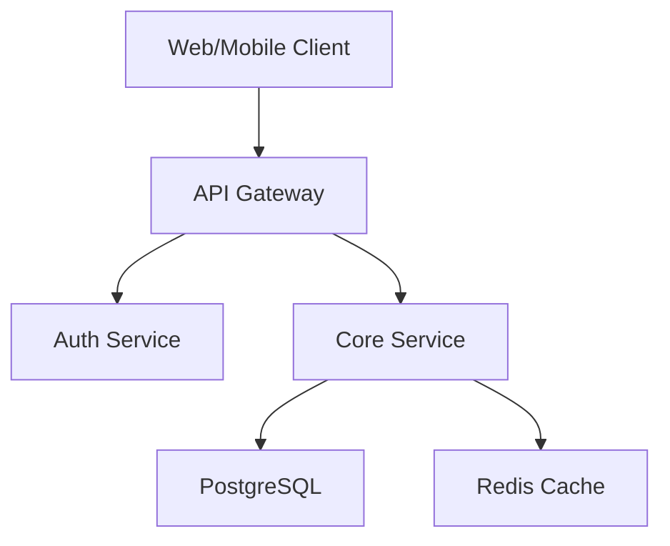

# System Design Template

## 1. Requirements Summary
- **Functional**: [List core features]
- **Non-Functional**: [Performance, Scalability, Security targets]

## 2. High-Level Architecture

## 3. Data Model
Define entities, relationships, and access patterns.

## 4. API Contracts
Reference OpenAPI 3.1 specification.

## 5. Technology Decisions
Document via ADRs (see `adr-template.md`).

## 6. Deployment Strategy
Define environments (Dev → Staging → Production) and CI/CD pipeline.

## 7. Risks & Mitigations
| Risk | Impact | Mitigation |
|---|---|---|
| Data loss | Critical | Automated backups, replication |
| API overload | High | Rate limiting, caching |
